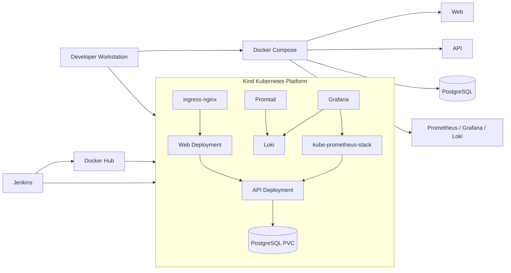

# Architecture Diagram

```mermaid
flowchart LR
  dev[Developer Workstation] --> compose[Docker Compose]
  compose --> cweb[Web]
  compose --> capi[API]
  compose --> cdb[(PostgreSQL)]
  compose --> cobs[Prometheus / Grafana / Loki]

  dev --> kind[Kind Cluster]
  jenkins[Jenkins] --> dockerhub[Docker Hub]
  jenkins --> kind
  dockerhub --> kind

  subgraph kind[Kind Kubernetes Platform]
    ingress[ingress-nginx] --> web[Web Deployment]
    web --> api[API Deployment]
    api --> db[(PostgreSQL PVC)]
    prom[kube-prometheus-stack] --> api
    promtail[Promtail] --> loki[Loki]
    grafana[Grafana] --> prom
    grafana --> loki
  end
```
